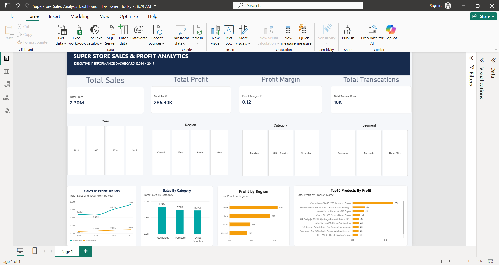

# Superstore Sales Analysis & Interactive Dashboard

## 📊 Project Overview

This project presents an end-to-end analysis of the Superstore sales dataset using **Excel, SQL, Python, and Power BI**.

The project focuses on understanding sales performance, profitability, customer segments, product performance, regional trends, and the relationship between discounts and profit. The analysis was transformed into an interactive Power BI dashboard to support quick business-level decision making.

---

## 🎯 Project Objective

The main objectives of this project are to:

* Clean and prepare sales data for analysis.
* Analyze sales and profit performance using SQL.
* Perform exploratory data analysis using Python.
* Identify important business trends and patterns.
* Analyze product, category, segment, and regional performance.
* Investigate the relationship between discount and profitability.
* Build an interactive Power BI dashboard for business insights.

---

## 🗂️ Dataset

The project uses the **Superstore Sales Dataset**.

The final cleaned dataset contains:

* **9,994 records**
* **21 columns**

Key fields include:

* Order ID
* Order Date
* Ship Date
* Ship Mode
* Customer ID
* Customer Name
* Segment
* Country
* City
* State
* Postal Code
* Region
* Product ID
* Category
* Sub-Category
* Product Name
* Sales
* Quantity
* Discount
* Profit

---

## 🛠️ Tools & Technologies

| Tool                | Purpose                                        |
| ------------------- | ---------------------------------------------- |
| **Microsoft Excel** | Data cleaning, validation and initial analysis |
| **SQL / MySQL**     | Data querying and business analysis            |
| **Python**          | Exploratory Data Analysis (EDA)                |
| **Pandas**          | Data manipulation and analysis                 |
| **NumPy**           | Numerical operations                           |
| **Matplotlib**      | Data visualization                             |
| **Power BI**        | Interactive dashboard and business reporting   |
| **GitHub**          | Project version control and portfolio          |

---

## 🔄 Project Workflow

```text
Raw Superstore Dataset
        ↓
Excel Data Cleaning
        ↓
SQL Data Analysis
        ↓
Python Exploratory Data Analysis
        ↓
Power BI Dashboard
        ↓
Business Insights
```

---

## 🧹 1. Excel – Data Cleaning & Preparation

Excel was used as the initial data preparation stage.

The data-cleaning process included:

* Checking for missing values.
* Identifying and resolving date-format inconsistencies.
* Validating the dataset structure.
* Checking data quality and consistency.
* Preparing the cleaned dataset for further analysis.

The final cleaned dataset contains **9,994 records**.

---

## 🗄️ 2. SQL – Business Analysis

SQL was used to perform structured queries and analyze the cleaned Superstore dataset.

The analysis included:

* Total sales and profit analysis.
* Category-level performance.
* Regional performance.
* Segment-level analysis.
* Product-level profitability.
* Aggregation and ranking queries.
* Filtering and grouping of business data.

SQL helped convert the cleaned dataset into meaningful business-level results.

---

## 🐍 3. Python – Exploratory Data Analysis

Python was used for exploratory analysis and visualization.

The analysis included:

* Data loading and inspection.
* Date-based analysis.
* Sales and profit trends.
* Category performance.
* Regional performance.
* Product profitability.
* Discount versus profit analysis.
* Visualization of important patterns.

### Python Libraries Used

* Pandas
* NumPy
* Matplotlib

---

## 📈 4. Power BI – Interactive Dashboard

The final analysis was converted into an interactive Power BI dashboard.

The dashboard includes:

* Total Sales KPI
* Total Profit KPI
* Profit Margin KPI
* Transaction KPI
* Year slicer
* Region slicer
* Category slicer
* Segment slicer
* Sales & Profit trend
* Sales by Category
* Profit by Region
* Top 10 Products by Profit

The slicers allow users to interactively filter the dashboard and analyze different parts of the business.

---

## 🔍 Key Insights

### Category Performance

**Technology** generated the highest sales among the three major categories, followed by **Furniture** and **Office Supplies**.

### Regional Profitability

The **West region** generated the highest profit among the four regions analyzed.

### Product Performance

The Power BI dashboard identifies the **Top 10 products by profit**, helping highlight the products contributing most strongly to profitability.

### Discount & Profitability

The analysis indicates a strong relationship between higher discounts and lower profitability. Higher discount levels are associated with a greater likelihood of negative profit.

> Note: Correlation between discount and profit does not by itself prove that discounting causes losses. Other business factors may also influence profitability.

---

## 📊 Dashboard Preview



---

## 📁 Project Structure

```text
Superstore-Sales-Analysis/
│
├── data/
│   └── cleaned_dataset.csv
│
├── excel/
│   └── Excel data cleaning and analysis workbook
│
├── images/
│   └── dashboard.png
│
├── powerbi/
│   └── Power BI dashboard (.pbix)
│
├── python/
│   └── Superstore_Sales_Analysis.ipynb
│
├── sql/
│   └── SQL analysis queries (.sql)
│
└── README.md
```

---

## 💡 Business Value

This project demonstrates an end-to-end data analytics workflow, from raw data preparation to interactive business reporting.

It demonstrates practical skills in:

* Data cleaning
* Data analysis
* SQL querying
* Exploratory Data Analysis
* Data visualization
* Business intelligence
* Dashboard development
* Business insight generation

---

## 👩‍💻 Author

**Vidya**

B.Tech Computer Science & Engineering — AI & ML

---

## ⭐ Project Outcome

The project combines **Excel, SQL, Python, and Power BI** into a single analytics workflow and demonstrates how raw sales data can be transformed into actionable business insights through data cleaning, analysis, visualization, and interactive reporting.
